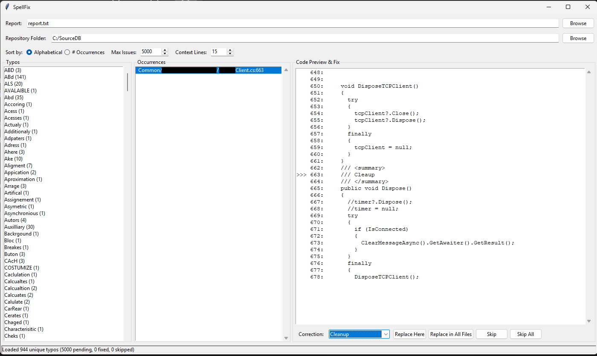

# SpellFix

GUI tool for reviewing and fixing spelling errors from the report from the tool `codespell`.
Perfect for solutions with hundreds or thousands of spelling errors across multiple files.



## Usage

```bash
pip install codespell
python -m codespell_lib C:\dev\MySourceCodeRepo >> C:\dev\spellFix\report.txt
python spell_fixer.py
```

* Select the report file
* Select the repository folder
* Go through typos and fix them with the buttons on the bottom right

## Report Format

UTF-16 encoded file with format:

```
.\path\to\file.ext:line: typo ==> correction1, correction2
```

Example:

```
.\src\Editor.Net\CoefficientForm.cs:8: coefficents ==> coefficients
.\src\Editor.Net\ConfigurationDataGrid.cs:506: DoubleClick ==> double-click
.\src\Editor.Net\UtilitiesGUI.xml:122: wether ==> weather, whether
.\src\Editor.Net\UtilitiesGUI.xml:150: wether ==> weather, whether
```
